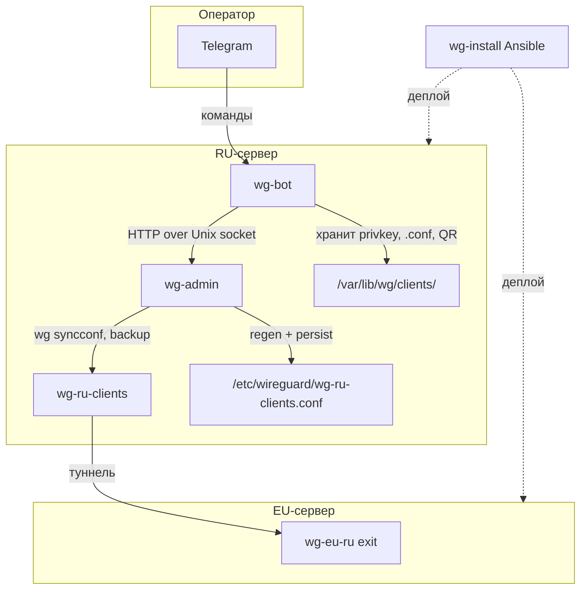

# Техническое задание v2.0

**Проект:** wg-bot  
**Назначение:** Telegram-интерфейс для управления клиентами WireGuard в связке с **wg-install** и **wg-admin**  
**Статус:** актуализировано под интеграцию  
**Дата:** 2026-06-16

---

## 1. Цель и место в экосистеме

**wg-bot** — операторский Telegram-бот для добавления, удаления и мониторинга VPN-клиентов **на RU-сервере**. Он **не** устанавливает сервер и **не** управляет WireGuard напрямую на уровне ядра — это делает **wg-admin**. Инфраструктуру поднимает **wg-install**.

**Scope развёртывания:** один инстанс бота на **RU entry-нode** (`wg-ru-clients`). EU-сервер бот **не** обслуживает — клиенты туда не подключаются.

### 1.1. Три компонента

| Компонент | Репозиторий | Роль |
|-----------|-------------|------|
| **wg-install** | Ansible-плейбук | Деплой RU/EU серверов: WireGuard, BIRD, nftables, туннель RU↔EU |
| **wg-admin** | Go-сервис (`wg-mgt`) | API over Unix socket: peers, конфиг, `wg syncconf`, drift/reconcile |
| **wg-bot** | Python + aiogram | Telegram UI, генерация клиентских ключей/конфигов/QR, RBAC операторов |



### 1.2. В scope wg-bot

- Telegram-интерфейс (команды, inline-кнопки, QR-коды)
- RBAC операторов (Telegram user ID)
- Генерация клиентской ключевой пары (`wg genkey` / `wg pubkey`)
- Автовыделение IP в подсети клиентов (IPv4 + IPv6)
- Сборка **полного клиентского** `.conf` (PrivateKey, Address, DNS, Endpoint, AllowedIPs, PersistentKeepalive)
- Хранение **приватных ключей** и метаданных клиентов (имя → pubkey)
- Вызов **wg-admin API** для серверных операций (add/remove/list/drift/status)
- Отображение статистики пиров (из wg-admin)

### 1.3. Вне scope wg-bot

- Установка WireGuard, BIRD, nftables, туннелей (**wg-install**)
- Генерация серверных ключей и base-конфигов (**wg-install** + vault)
- Применение конфигурации к интерфейсу, backup, drift/reconcile (**wg-admin**)
- Split-маршрутизация, BGP, antifilter (**wg-install** / BIRD на RU)
- Управление EU-сервером и client peers на EU
- Биллинг, мониторинг, web-UI

---

## 2. Контекст wg-install

### 2.1. Архитектура VPN

Клиенты подключаются **только к RU**. EU — exit-нода, client peers на EU **не создаются**.

```
Клиент ──443/udp──► RU (wg-ru-clients)
                         │
                    wg-ru-eu ──443/udp──► EU (wg-eu-ru) ──► Интернет
```

| Сервер | Интерфейсы | Назначение |
|--------|------------|------------|
| **RU** | `wg-ru-clients`, `wg-ru-eu` | Entry + split-маршрутизация (BIRD) |
| **EU** | `wg-eu-ru` | Exit, NAT |

### 2.2. Сеть клиентов (RU)

| Параметр | Значение (из `wg-install`) |
|----------|----------------------------|
| IPv4-подсеть | `10.66.66.0/24`, gw `10.66.66.1` |
| IPv6-подсеть | `fd66:66::/64`, gw `fd66:66::1` |
| Порт клиентов | `443/udp` |
| MTU | `1420` |
| DNS (при `domain_ru_enabled`) | `10.66.66.1` (локальный резолвер на RU) |

### 2.3. Пути на сервере (после wg-install)

| Путь | Назначение | Кто пишет |
|------|------------|-----------|
| `/etc/wireguard/wg-ru-clients.conf` | Серверный wg-quick конфиг | **wg-admin** (regen + syncconf) |
| `/etc/wireguard/wg-admin/peers/` | JSON метаданные пиров (по SHA256 pubkey) | **wg-admin** |
| `/etc/wireguard/wg-admin/backups/` | Бэкапы конфигов | **wg-admin** |
| `/var/lib/wg/clients/` | Клиентские `.conf`, `.json`, приватные ключи | **wg-bot** |

### 2.4. Что wg-install явно не делает

Из `docs/TZ.md` wg-install:

> Создание client peers и конфигов клиентов — **вне scope**.

**Целевая схема управления клиентами:** wg-bot + wg-admin на RU-сервере.

### 2.5. wg-client.sh — только smoke-test

Скрипт `wg-install/scripts/wg-client.sh` (устанавливается как `/usr/local/bin/wg-client`) **не является целевой схемой работы**. Назначение:

- быстрая проверка **свежеустановленного** RU-сервера после прогона wg-install;
- ручное добавление тестового peer без Telegram и wg-admin;
- отладка сети до деплоя production-стека.

В production wg-client.sh **не используется**. Бот и wg-admin не обязаны быть совместимы с форматом `*.env` или блочными маркерами `# BEGIN wg-client peers` — после перехода на wg-admin серверный конфиг перегенерируется из JSON storage.

### 2.6. Серверный конфиг после перехода на wg-admin

wg-install при первичном деплое создаёт `wg-ru-clients.conf` с пустым блоком client peers. После первого `/addclient` через бота конфиг **полностью ведёт wg-admin**: plain `[Peer]` секции из JSON storage, без маркеров wg-client.sh.

**wg-bot не парсит серверный конфиг** — источник истины по пирам на сервере: **wg-admin**.

---

## 3. Контекст wg-admin

### 3.1. Назначение

Локальный root-сервис (systemd), HTTP API over Unix socket. Явно спроектирован как backend для Telegram-бота (`specs.md`).

### 3.2. API (используемые wg-bot)

| Метод | Endpoint | Когда вызывает wg-bot |
|-------|----------|----------------------|
| POST | `/peer/add` | `/addclient` — после генерации ключей и IP |
| POST | `/peer/remove` | `/removeclient` |
| POST | `/peer/rotate` | `/rotateclient` |
| GET | `/peer/list` | `/listclients` |
| GET | `/interface/status` | `/status` |
| GET | `/peer/drift` | опционально: `/status`, алерт админу |
| POST | `/interface/reload` | опционально: ручной reload |

**wg-admin не предоставляет:** генерацию client private key, сборку client `.conf`, QR-коды.

### 3.3. Модель данных wg-admin

Peer идентифицируется по **public_key**. Файл: `{config-dir}/peers/{sha256(pubkey)}.json`.

```json
{
  "public_key": "base64...",
  "allowed_ips": ["10.66.66.10/32", "fd66:66::10/128"],
  "persistent_keepalive": 25,
  "description": "alice",
  "endpoint": null
}
```

Поле `description` — человекочитаемое имя клиента (wg-bot передаёт имя из `/addclient`).

### 3.4. Применение конфигурации

wg-admin на каждую мутацию:

1. Сохраняет JSON peer
2. Пересобирает серверный конфиг (base + все peers)
3. Применяет через `wg syncconf` (не `wg set` по одному peer)
4. Пишет полный wg-quick конфиг в `/etc/wireguard/{interface}.conf`
5. Создаёт backup

При ошибке — rollback JSON storage.

### 3.5. Drift и reconcile

- `GET /peer/drift` — сравнение storage vs runtime (`wg show dump`)
- При старте wg-admin: `-reconcile-on-start=true`, `-reconcile-source=storage` (по умолчанию storage → WG)

wg-bot **не** занимается drift detection — только может показывать результат `/peer/drift` админу.

### 3.6. Авторизация wg-admin

| Уровень | Механизм |
|---------|----------|
| Доступ к сокету | Права файла сокета (`0660`), группа `wg-admin` |
| Mutating endpoints | Опционально `-allowed-uids` (SO_PEERCRED) |

wg-bot должен запускаться от пользователя, входящего в группу `wg-admin`, с UID в `-allowed-uids`.

### 3.7. Пример systemd (RU, production)

```ini
ExecStart=/usr/local/bin/wg-admin \
  -socket /run/wg-admin/wg-admin.sock \
  -socket-group wg-admin \
  -interface wg-ru-clients \
  -config-dir /etc/wireguard/wg-admin \
  -system-config-dir /etc/wireguard \
  -reconcile-on-start=true \
  -reconcile-source=storage
After=network.target wg-quick@wg-ru-clients.service
```

---

## 4. Разделение ответственности

### 4.1. Матрица «кто что делает»

| Операция | wg-install | wg-admin | wg-bot |
|----------|:----------:|:--------:|:------:|
| Установка WireGuard, BIRD, nftables | ✓ | | |
| Серверные ключи (vault) | ✓ | | |
| Base-конфиг интерфейса | ✓ | хранит копию | |
| Добавление peer на сервер | | ✓ | вызывает API |
| Удаление peer | | ✓ | вызывает API |
| `wg syncconf`, backup | | ✓ | |
| Drift / reconcile | | ✓ | показывает |
| Генерация client keypair | | | ✓ |
| Client `.conf` + QR | | | ✓ |
| Хранение client private key | | | ✓ |
| Автовыделение IP | | | ✓ |
| Telegram RBAC | | | ✓ |
| Endpoint в client conf | | | ✓ (из config) |
| DNS в client conf | | | ✓ (из config) |

### 4.2. Поток `/addclient <name>`

```
1. wg-bot: проверить RBAC (admin)
2. wg-bot: валидировать имя, проверить уникальность в CLIENT_DIR
3. wg-bot: wg genkey + wg pubkey  →  priv, pub
4. wg-bot: выделить свободный IPv4 (.x/32) и IPv6 (fd66:66::x/128)
5. wg-bot: POST /peer/add {
     public_key: pub,
     allowed_ips: ["10.66.66.x/32", "fd66:66::x/128"],
     persistent_keepalive: 25,
     description: name
   }
6. wg-admin: save JSON → regen config → wg syncconf → backup
7. wg-bot: собрать client .conf:
     [Interface] PrivateKey, Address (v4+v6), DNS, MTU
     [Peer] PublicKey (server), AllowedIPs (0.0.0.0/0, ::/0), Endpoint, PersistentKeepalive
8. wg-bot: атомарно записать {name}.json + {name}.conf в CLIENT_DIR
9. wg-bot: отправить .conf + QR в Telegram
10. При ошибке шага 5–6: не сохранять client files (wg-admin сам rollback)
    При ошибке шага 8 после успешного add: POST /peer/remove + алерт админу
```

### 4.3. Поток `/removeclient <name>`

```
1. wg-bot: загрузить {name}.json → pubkey
2. wg-bot: POST /peer/remove { public_key: pubkey }
3. wg-admin: remove JSON → regen → syncconf
4. wg-bot: удалить {name}.json, {name}.conf
```

### 4.4. Поток `/rotateclient <name>`

См. §12.3 — кратко: новый keypair → `POST /peer/rotate` → reissue `.conf` + QR, IP и имя сохраняются.

---

## 5. Конфигурация wg-bot

### 5.1. config.yaml (для RU после wg-install)

```yaml
# --- WireGuard (из wg-install inventory) ---
WG_INTERFACE: wg-ru-clients
WG_SUBNET: "10.66.66.0/24"
WG_SUBNET_V6: "fd66:66::/64"

# --- Клиентские артефакты ---
CLIENT_DIR: /var/lib/wg/clients

# --- Параметры client .conf (из client-manager.conf / inventory) ---
SERVER_PUBLIC_KEY: "<wg show wg-ru-clients public-key>"
SERVER_ENDPOINT: "wgrutest.example.com"   # или public_ipv4 RU
WG_CLIENT_PORT: 443
WG_MTU: 1420
WG_DNS: "10.66.66.1"                      # обязательно при domain_ru_enabled
CLIENT_ALLOWED_IPS: "0.0.0.0/0, ::/0"
PERSISTENT_KEEPALIVE: 25

# --- wg-admin ---
WG_ADMIN_SOCKET: /run/wg-admin/wg-admin.sock

# --- Telegram ---
TELEGRAM_TOKEN: "..."
ALLOWED_USERS:                          # superadmin Telegram IDs
  - 123456789
```

### 5.2. Маппинг wg-install → wg-bot

| wg-install (`group_vars`) | wg-bot config |
|---------------------------|---------------|
| `wg_client_ipv4_prefix` | `WG_SUBNET` |
| `wg_client_ipv6_prefix` | `WG_SUBNET_V6` |
| `wg_client_port` | `WG_CLIENT_PORT` |
| `wg_mtu` | `WG_MTU` |
| `public_ipv4` (ru) / DNS hostname | `SERVER_ENDPOINT` |
| `domain_ru_dns_address` | `WG_DNS` |
| interface `wg-ru-clients` | `WG_INTERFACE` |
| vault: server public key | `SERVER_PUBLIC_KEY` |

### 5.3. users.json

Динамический список операторов (роли `admin` / `user`). Superadmin — только из `ALLOWED_USERS` в config.yaml.

---

## 6. Функциональные требования

### 6.1. Команды Telegram

| Команда | RBAC | Backend |
|---------|------|---------|
| `/help` | user+ | — |
| `/status` | user+ | `GET /interface/status` (+ форматирование) |
| `/listclients` | user+ | `GET /peer/list` + merge с CLIENT_DIR (имена) |
| `/addclient <name>` | admin | keygen + IP + `POST /peer/add` + client conf + QR |
| `/removeclient <name>` | admin | `POST /peer/remove` + удаление файлов |
| `/rotateclient <name>` | admin | keygen + `POST /peer/rotate` + новый conf + QR |
| `/drift` | admin | `GET /peer/drift` |
| `/listusers` | admin | UserManager |
| `/adduser <id> <role>` | admin | UserManager |
| `/removeuser <id>` | admin | UserManager |

**Удалить / deprecated:**

| Команда | Причина |
|---------|---------|
| `/syncconfig` | Заменяется wg-admin storage + reconcile; парсинг `# BEGIN_PEER` несовместим с wg-install |

### 6.2. Клиентский `.conf` (целевой формат)

```ini
[Interface]
PrivateKey = <generated>
Address = 10.66.66.10/32, fd66:66::10/128
DNS = 10.66.66.1
MTU = 1420

[Peer]
PublicKey = <SERVER_PUBLIC_KEY>
AllowedIPs = 0.0.0.0/0, ::/0
Endpoint = wgrutest.example.com:443
PersistentKeepalive = 25
```

### 6.3. Метаданные клиента (`{name}.json`)

```json
{
  "name": "alice",
  "pubkey": "...",
  "client_ip": "10.66.66.10/32",
  "client_ip_v6": "fd66:66::10/128",
  "conf_path": "/var/lib/wg/clients/alice.conf",
  "created_at": "2026-06-16T12:00:00Z"
}
```

Приватный ключ хранится **только** в `.conf` (mode `0600`), не в JSON.

---

## 7. Архитектура кода wg-bot

### 7.1. Целевые модули

| Модуль | Ответственность |
|--------|-----------------|
| `main.py` | Telegram handlers, orchestration |
| `wg_admin_client.py` | **новый** — HTTP over Unix socket к wg-admin |
| `client_manager.py` | **новый** — keygen, IP allocation, client conf builder |
| `users.py` | RBAC операторов (без изменений по смыслу) |
| `wg_manager.py` | **deprecated** → заменяется `wg_admin_client` + `client_manager`; оставить keygen/IP/conf builder |

### 7.2. WgAdminClient (интерфейс)

```python
class WgAdminClient:
    def add_peer(public_key, allowed_ips, description, persistent_keepalive=25) -> None
    def remove_peer(public_key) -> None
    def rotate_peer(old_public_key, new_public_key) -> None
    def list_peers() -> list[PeerInfo]
    def interface_status() -> InterfaceStatus
    def detect_drift() -> DriftReport
```

Реализация: `httpx` / `aiohttp` с `transport=UnixTransport` или `curl`-обёртка через subprocess.

---

## 8. Нефункциональные требования

### 8.1. Безопасность

| Требование | Детали |
|------------|--------|
| Client private keys | Только в wg-bot `CLIENT_DIR`, mode `0600`; wg-admin **никогда** не получает |
| Telegram RBAC | Whitelist + роли; mutating команды — admin |
| Логи | Не логировать токен, private keys, stderr wg |
| CLIENT_DIR | Владелец = UID процесса бота, без group/other write |
| Атомарная запись | temp + replace для `.json`, `.conf`, `users.json` |
| wg-admin access | Процесс бота в группе `wg-admin`, UID в `-allowed-uids` |

### 8.2. Деплой на RU-сервере (рекомендуется: Docker)

**Гибридная схема:** wg-admin и WireGuard — **systemd на хосте**; wg-bot — **Docker**.

```
RU-сервер
├── wg-quick@wg-ru-clients   (wg-install)
├── wg-admin.service         (root, Unix socket)
└── docker compose: wg-bot   (UID 1000, group wg-admin)
```

| Артефакт | Назначение |
|----------|------------|
| `Dockerfile` | образ: Python 3.12 + wireguard-tools + uv |
| `docker-compose.yml` | volumes, `group_add`, env |
| `config.yaml.example` | конфиг для `/etc/wg-bot/config.yaml` |
| `.env.example` | `TELEGRAM_TOKEN`, `WG_ADMIN_GID` |
| `docs/DEPLOY.md` | пошаговая инструкция |

**Volumes:**

| Host | Container | RW |
|------|-----------|-----|
| `/run/wg-admin` | `/run/wg-admin` | ro (socket) |
| `/var/lib/wg/clients` | `/var/lib/wg/clients` | rw |
| `/var/lib/wg/bot` | `/app/state` | rw (`users.json`, лог) |
| `/etc/wg-bot/config.yaml` | `/config/config.yaml` | ro |

**Обязательно на хосте:**

```bash
WG_ADMIN_GID=$(getent group wg-admin | cut -d: -f3)   # в .env для group_add
sudo chown -R 1000:1000 /var/lib/wg/clients /var/lib/wg/bot
```

wg-admin: `-socket-group wg-admin`, `-allowed-uids` включает `1000` (UID `wgbot` в образе).

`TELEGRAM_TOKEN` — через env (приоритет над config.yaml).

### 8.2.1. Альтернатива: systemd без Docker

Для dev или если Docker недоступен:

```ini
# /etc/systemd/system/wg-bot.service
[Unit]
Description=WireGuard Telegram Bot
After=network.target wg-admin.service wg-quick@wg-ru-clients.service
Requires=wg-admin.service

[Service]
User=deploy
Group=wg-admin
ExecStart=/opt/wg-bot/.venv/bin/python main.py -c /etc/wg-bot/config.yaml
Restart=always

[Install]
WantedBy=multi-user.target
```

Бот **не root** — wg-привилегии через wg-admin (root).

### 8.3. Стек

- Python ≥ 3.12
- aiogram ≥ 3.22
- PyYAML, qrcode, Pillow
- HTTP-клиент с поддержкой Unix socket
- pytest + GitHub Actions

---

## 9. Миграция с текущей реализации (v1)

Текущий wg-bot (v1) работает автономно: прямой `sudo wg set`, `CLIENT_DIR` с `.json`/`.conf`, `/syncconfig` с `# BEGIN_PEER`.

| v1 (сейчас) | v2 (целевое) |
|-------------|--------------|
| `sudo wg set/show` | HTTP → wg-admin |
| `WG_INTERFACE: wg0` | `wg-ru-clients` |
| `WG_SUBNET: 10.10.0.0/24` | `10.66.66.0/24` + IPv6 |
| `DNS = 1.1.1.1` | `10.66.66.1` |
| Нет Endpoint в conf | `SERVER_ENDPOINT:443` |
| `/syncconfig` | `/drift` + wg-admin reconcile |
| `# BEGIN_PEER` парсинг | удалить |
| IPv4-only | dual-stack |
| Root / sudo для wg | User deploy + wg-admin |

---

## 10. Критерии приёмки

### 10.1. Интеграция с wg-install

- [ ] Бот деплоится на RU-сервер, поднятый wg-install
- [ ] `WG_INTERFACE=wg-ru-clients`, подсети совпадают с inventory
- [ ] Client conf содержит корректный DNS, Endpoint `:443`, MTU `1420`, IPv4+IPv6
- [ ] Клиент после подключения получает handshake и маршрутизацию через RU (split) / EU (не-РФ)

### 10.2. Интеграция с wg-admin

- [ ] `/addclient` → peer появляется в `GET /peer/list` и `wg show wg-ru-clients`
- [ ] Peer persisted в `/etc/wireguard/wg-ru-clients.conf` (через wg-admin regen)
- [ ] `/removeclient` → peer удалён из runtime и storage
- [ ] `/rotateclient` → новый pubkey на сервере, IP тот же, старый conf не работает
- [ ] `/drift` → `in_sync: true` после штатных операций
- [ ] Перезапуск wg-admin с `-reconcile-on-start` не ломает clients, созданных ботом
- [ ] Бот работает без root/sudo

### 10.3. Безопасность и UX

- [ ] RBAC: user видит status/list, admin — add/remove
- [ ] Private keys не попадают в логи и wg-admin
- [ ] QR + `.conf` доставляются в Telegram
- [ ] Unit-тесты + CI проходят

---

## 11. Связанные документы

| Документ | Путь |
|----------|------|
| wg-install ТЗ | `wg-install/docs/TZ.md` |
| wg-admin specs | `wg-mgt/specs.md` |
| wg-admin API | `wg-mgt/API.md` |
| wg-admin CONFIG | `wg-mgt/CONFIG.md` |
| wg-install smoke-test script | `wg-install/scripts/wg-client.sh` |
| Docker deploy | `docs/DEPLOY.md` |

---

## 12. Ротация ключей клиента

### 12.1. Решение

**Ротация ключей — in scope wg-bot.** Команда `/rotateclient <name>` (admin).

Без участия бота ротация **неполная**: wg-admin меняет только **серверную** сторону (public key peer), а **приватный ключ клиента** хранится в wg-bot (`CLIENT_DIR`). Оператор не сможет выдать пользователю рабочий конфиг после `POST /peer/rotate` через curl — нужна пара «новый privkey + новый .conf + QR».

### 12.2. Что делает wg-admin (`POST /peer/rotate`)

Атомарно на сервере:

1. Загружает peer по `old_public_key`
2. Создаёт новую запись с `new_public_key`, **сохраняя** `allowed_ips`, `description`, `endpoint`, `persistent_keepalive`
3. Удаляет старую запись
4. Пересобирает конфиг и применяет `wg syncconf`
5. При ошибке apply — rollback storage

**Эффект для клиента:** активная сессия со **старым** ключом **немедленно обрывается**. IP-адреса **не меняются**.

wg-admin **не** генерирует client private key и **не** отдаёт client `.conf`.

### 12.3. Что делает wg-bot (`/rotateclient <name>`)

```
1. RBAC: admin
2. Загрузить {name}.json → old_pubkey, client_ip, client_ip_v6
3. wg genkey + wg pubkey → new_priv, new_pub
4. POST /peer/rotate { old_public_key, new_public_key }
5. Пересобрать client .conf (новый PrivateKey, те же Address/DNS/Endpoint)
6. Атомарно обновить {name}.conf и pubkey в {name}.json
7. Отправить новый .conf + QR в Telegram
8. (опционально) сохранить {name}.conf.bak с timestamp — только на диске, не в Telegram
```

**Rollback при ошибке:**

| Этап упал | Действие |
|-----------|----------|
| До шага 4 | ничего не менялось |
| Шаг 4 (rotate API) | wg-admin сам rollback storage; client files не трогаем |
| После шага 4, до записи files | **критично:** сервер уже на new_pubkey, client conf ещё со старым privkey → повторить rotate обратно (new→old) или алерт админу + `/drift` |
| После записи files | штатно; старый conf недействителен |

Для шага «после успешного rotate, ошибка записи» — wg-bot **не** может откатить rotate через API (нет reverse-rotate endpoint). Стратегия: **сначала** успешный rotate, **сразу** atomic write; при ошибке write — лог + алерт «клиент {name} требует ручного reissue, pubkey на сервере: …».

### 12.4. Rotate vs remove + add

| | `/rotateclient` | `/removeclient` + `/addclient` |
|--|-----------------|--------------------------------|
| IP клиента | **сохраняется** | новый IP |
| Имя клиента | **сохраняется** | можно переиспользовать имя |
| Peer на сервере | replace pubkey | delete + create |
| Когда использовать | компрометация ключа, плановая ротация, утеря conf без компрометации | клиент больше не нужен / нужен «чистый» слот |

### 12.5. UX и безопасность

- **Подтверждение:** перед rotate — inline-кнопка «Подтвердить ротацию {name}» (защита от опечатки).
- **Предупреждение в ответе:** «Старый конфиг перестанет работать. Переустановите VPN на всех устройствах клиента.»
- **RBAC:** только admin; user **не** может ротировать.
- **Аудит:** логировать `{admin_tg_id} rotated client {name}`, без private keys.
- **Выдача конфига:** только в личку инициатору команды (не в групповой чат, если бот когда-либо будет добавлен в группу).
- **Повторная ротация:** без cooldown (оператор может ошибиться — ограничение не нужно).

### 12.6. Критерии приёмки (rotate)

- [ ] После `/rotateclient alice` handshake возможен только с **новым** conf
- [ ] IP alice (`10.66.66.x`, `fd66:66::x`) не изменился
- [ ] `GET /peer/drift` → `in_sync: true`
- [ ] Старый `.conf` не работает (нет handshake)
- [ ] Новый QR сканируется WireGuard-клиентом

---

## 13. Зафиксированные решения

| # | Вопрос | Решение |
|---|--------|---------|
| 1 | wg-client.sh | Smoke-test после wg-install; **не** production, **не** fallback для бота |
| 2 | EU-сервер | Бот **только на RU**; client peers на EU **не создаются** |
| 3 | Ротация ключей | **In scope:** `/rotateclient` через wg-admin `POST /peer/rotate` + reissue conf/QR |
| 4 | Rename клиента | **Out of scope v2.** Имя = `{name}.json` filename + `description` в wg-admin; rename = remove + add с новым именем |
